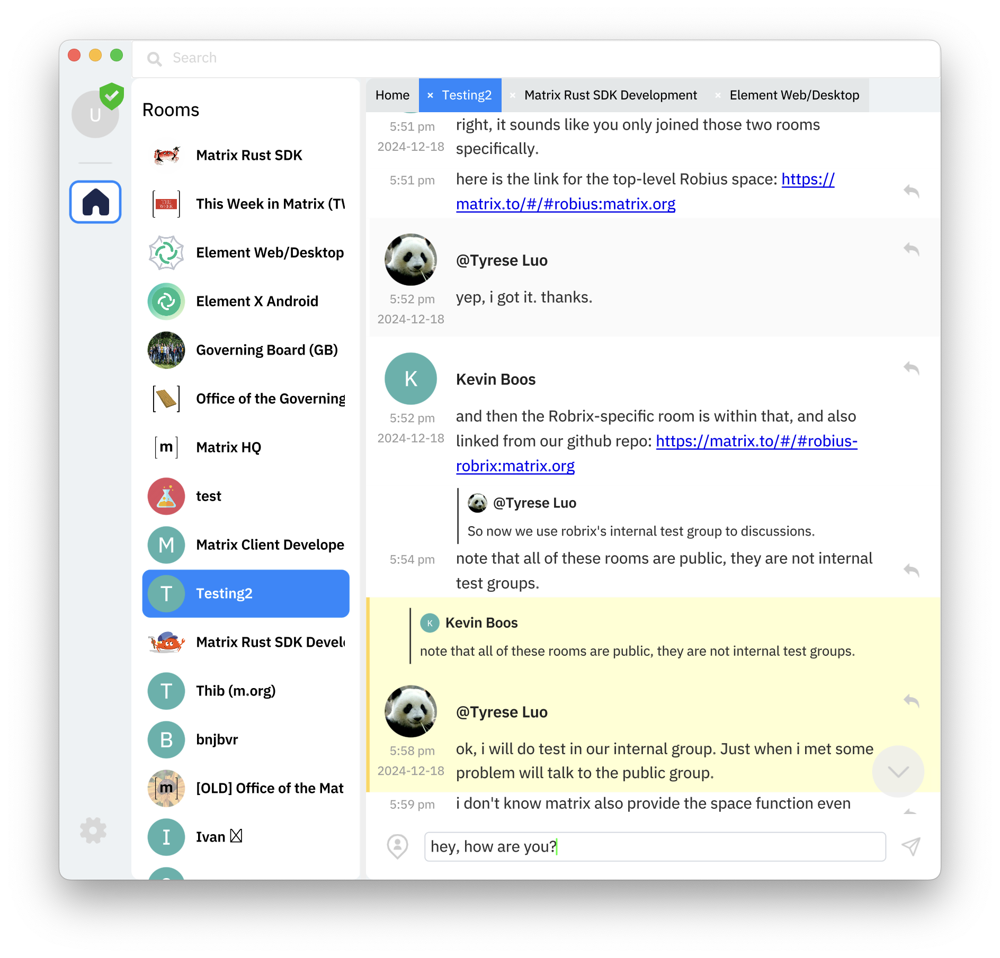
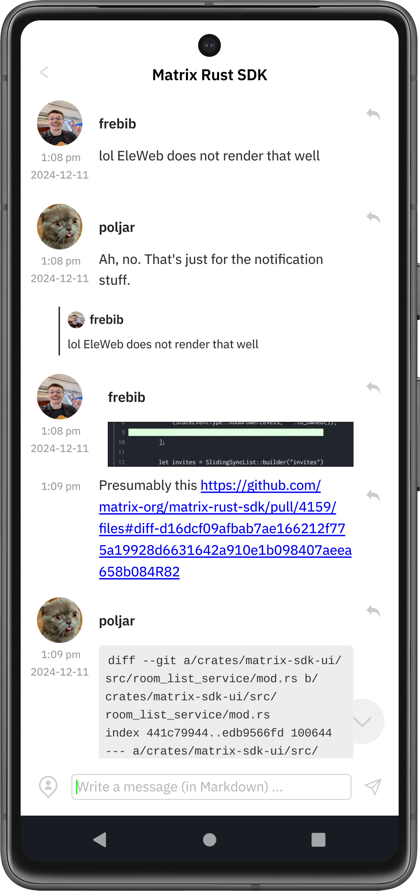

# Project Robius in 2024: a year of Rust App Dev

*Author: [Kevin Boos](https://github.com/kevinaboos). Published December 28th, 2024.*

This past year marked the first year of work on **Project Robius**: an open-source decentralized endeavor to enable developers to write immersive, fully-featured apps in pure Rust that work seamlessly across all major platforms.

> 🛈 Project Robius in a nutshell
>
> While GUIs are the foundation of an app, there is more to developing a modern featureful app than just drawing a UI.
> Project Robius aims to fill in the gaps in the Rust app dev ecosystem by focusing on everything *except*  the UI, such as abstractions for platform features & OS services, build & packaging tooling, and more.
> We leave UI work to the experts behind the many excellent Rust UI toolkits under active development.

 
In this post, we'll take a look back on what we've accomplished so far to make the world of Rust App Dev a little better:
* The major apps we've built using [Makepad] + Robius together
* The crate abstractions we've published for accessing platform-provided features from Rust code
* The contributions we've made to existing open-source projects in the App Dev space
* The connections we've fostered throughout the Rust community

We'll also take a deeper look at **Robrix**,  a multi-platform [Matrix](https://matrix.org/) chat client written from scratch in Rust using the [Makepad UI toolkit] and Robius components.
We started building Robrix about one year ago as a "flagship" Robius app to help drive the development (and priority) of various Robius components and demonstrate their utility.

## Apps built in 2024 using Makepad + Robius

We (with help from many collaborators) have built both small proof-of-concept demo apps and larger "flagship" apps using Makepad + Robius. Two of the most complex flagship apps we've been developing in 2024 are:
1. [Robrix]: a Matrix chat client for power users
2. [Moly]: a local LLM chat runtime and AI agent explorer (previously "Moxin")

Both of these apps are fully open-source and have releases available on GitHub, in case you'd like to download and try them out.

### 1. Robrix: an up-and-coming Matrix chat client for power users

We started Robrix about one year ago with the intention of it being a "flagship" Robius app — one that would help drive the development (and priority) of various Robius components and demonstrate their utility.
Since then, our plans for Robrix have expanded beyond it serving as just a demo app or a basic Matrix client; we discuss our longer-term, multi-stage [vision for Robrix later in this article](#robrix-roadmap-for-2025-and-beyond).

Robrix has come a long way over the past year, thanks to 750+ commits from 10 contributors!
Since starting from scratch, we have created a functional Matrix chat client with most fundamental features already complete and working well, as shown by our feature status tracker below.

With these features in place, we have began dogfooding Robrix as a daily Matrix client!

While not all main features are complete, Robrix *does* already have some cool features that help both power users and casual users be more productive.
The biggest unique feature of Robrix is an "IDE-like" desktop UI that can display multiple rooms side-by-side in separate tabs, which can be docked and moved around via drag-n-drop actions.
No more wasted horizontal space!

Another cool feature is that Robrix's UI can automatically transition to different view layouts based on window size. This enables our single codebase to run seamlessly on desktop and mobile platforms, but you can also use any view on any platform if you want.
For example, we frequently enjoy using the mid-size tablet view (below, left) or the narrow mobile view (below, middle) on a smaller laptop screen too, in addition to on our smartphones (below, right).

  
  
  

Beyond a sleek UI, Robrix also leverages multiple Robius crates for deep integration with the native platform:
* `robius-open` to open URLs, images, and downloaded files
* `robius-location` to obtain and share the user's current location in a Matrix room
* `robius-url-handler` to register Robrix as a default handler for the `matrix:` URL scheme (and others)
* `robius-directories` to ensure that we store app data and cached content in the platform-canonical directories
* `robius-keychain` to store a user's login session tokens (this is a WIP)
* `robius-packaging-commands` to help easily build app bundles for desktop platforms using cargo-packager
* In the future, we'll allow users to mark individual rooms as "secret", such that they are hidden behind an authentication prompt provided by `robius-authentication`

In addition to a sleek UI and robust platform integration, Robrix is highly performant and efficient thanks to its underlying pure-Rust stack and Makepad's emphasis on lightweight, performant code.
Our rough benchmarks show that Robrix can easily achieve over 120 FPS (TODO: measure this) on an older M1 Macbook Pro, even when displaying a dozen rooms side-by-side.
Robrix achieves this while using only around 100MB of system memory, which is less than 25% of what most Electron-based Matrix desktop clients consume.
* TODO: CPU Utilization??

Most importantly, thanks to the power of Makepad and Robius, Robrix has zero platform-specific code.
This makes it easy to maintain and develop features/bugfixes quickly, as you don't have to consider the idiosyncracies of each platform.
Thus, we invite you to check out our codebase and contribute any cool missing features that you'd love to have!

To learn more about Robrix, check out the following:
* [Robrix on GitHub](https://github.com/project-robius/robrix)
* [A recent conference talk about Robrix](https://www.youtube.com/watch?v=DO5C7aITVyU) ([PDF slides](https://github.com/project-robius/files/blob/main/GOSIM%20China%202024/Robrix%20Talk%20GOSIM%20China%20October%2017%2C%202024.pdf))
* [Robrix's Project Tracker on GitHub](https://github.com/orgs/project-robius/projects/4/)
* [Chat with us about Robrix on Matrix](https://matrix.to/#/#robius-robrix:matrix.org)

### 2. Moly: chat with local LLMs and custom AI agents

TODO: describe Moly in a general sense, provide a screenshot. Explain how it has driven development of Makepad features like fundamental widgets (modals, sliding panels, etc).

Most of Project Robius's work (my work) on Moly was spread across these directions:
1. Standardizing app behaviors to be more platform-compliant and canonical
2. Implementing a Rust-based installer and configurator for the [Wasmedge WASM runtime], which is what Moly uses to run LLMs locally
3. Creating packaging logic and configuring the build tooling to generate Moly app bundles that work across all 3 major desktop platforms

## Robius crates for platform feature abstractions

As our primary objective, we have published several crates intended to be used directly by app devs to access a given platform feature or OS service from their app. The main goal here is for each crate to offer a safe, platform-agnostic abstraction, such that the app dev need not worry about writing any platform-specific code or dealing with each platforms' idiosyncracies.

We began working on these crates in late Spring of 2024; development has been a bit intermittent but we are ramping up for the coming year. While we expect to publish many more in the future, here is the current list:

* [`robius-location`]: access the current geolocation of the user's device
* [`robius-authentication`]: display a native biometric or password authentication prompt
* [`robius-open`]: open a URI or file in a different app (determined by the system)
* [`robius-directories`]: access platform-standard directory locations for app data, user data, config, cache, etc
    * a fork of the [`directories`] crate that adds support for Android
* [`robius-url-handler`]: register your Rust app as the default handler for a URL scheme or file association
* [`robius-keychain`]: store and retrieve secure data/passwords from the platform's secure storage facility
    * This crate was written from scratch, but we discovered [`keyring-rs`] shortly after finishing it. We intend to contribute our additional features, mostly Android support, into `keyring-rs`.
* [`robius-file-dialog`]: display a native dialog for picking a file, directory, or image
    * This is a custom implementation for iOS and Android, but uses [`rfd`] under the hood for Desktop platforms.

We've also released some "lower-level" crates that aren't intended for direct use by an app developer, but they'd be useful for other developers that want to create their own platform abstractions.
The above crates depend on these in various ways.
* [`android-build`]: enables a Rust crate to automatically build Java code for Android targets, as part of a cargo build process via a `build.rs` build script.
    * The Java classfile(s) can then be used by your Rust app, typically via one of the above platform feature abstraction crates.
* [`robius-android-env`]: abstracts access to Android states owned by various UI toolkits.
    * Many Android platform features require passing in the current activity or accessing the JavaVM or JNI environment state.
    * This crate enables us to write other Rust crates that access Android platform features, such that they work seamlessly across many different UI toolkits.
    * Directly supports [`ndk-context`], an existing crate which is compatible with many other UI toolkit components, e.g., [Winit]
        * This enables all of the above platform feature abstraction crates (plus any crate that depends on `robius-android-env`) to work with Winit-based apps on Android.
    * Compared to `ndk-context`, the `robius-android-env` crate offers a "batteries-included" experience that automatically "just works" with supported UI toolkits, such that the app dev doesn't have to add any code to make things work.

## Contributions to other Rust app dev projects
In addition to creating, maintaining, and publishing our own crates for Rust app dev, we also strive to contribute to and improve existing crates that are already prominently used in the ecosystem.

TODO: list crates that we've contributed to

* Project Robius started using and making contributions to [`cargo-packager`], a packaging solution for Rust apps on Desktop target platforms created and open-sourced by Crab-Nebula, the folks behind the excellent Tauri ecosystem
  * We plan to contribute support for generating mobile app bundles, namely Android, to cargo-packager
  * We also intend to add support for other Desktop package formats, namely Flatpack
* [`robius-packaging-commands`]: a companion to `cargo-packager` that makes it easier to build & configure complex apps
  * Automatically handles Makepad configuration and resource/asset discovery & bundling

* We have made myriad major contributions to the Makepad UI toolkit, as Robrix and Moly are two of the most complex apps built in Makepad
    * Improvements to `PortalList`, a virtual viewport list with infinite scrolling
        * Better API with more introspection into the positional & visibility state of items in the list, its scrolling state, and its item caching behavior
        * Efficient implementations of smooth scrolling animations, e.g., jump to bottom or jump to a given item index
    * Multiple new widgets: Avatar images with text fallback,
    * Improvements to the underlying Android platform layer
    * An app lifecycle model with dedicated Events for all lifecycle stages, which is consistent across all platforms
    * Easier and more ergonomic `Actions` (widget-to-widget message events), plus support for delivering an action to a widget from a background thread or async task context
    * Rich text formatting, used to display both HTML and Markdown content
    * TODO: list others things we added to makepad
   
   

## Cross-collaboration with other UI and App Dev orgs
* Project Robius hosted an App Dev unconference at RustNL 2024 (and also GOSIM Beijing 2024), in which a few dozen Rust developers from across the world met up to discuss the shared problems we all face in developing Rust apps and UI toolkits.
    * A few of the topics & ideas we discussed there have already made it past the discussion phase and have become real projects!
        * `kittest`: a universal UI testing framework built upon the AccessKit accessibility framework, spearheaded by the eGUI team!
        * Dioxus's work on hotreloading not just UI DSL code, but even real Rust code that implements app behavior!
        * Feedback given to the Rust lang & libs teams. We hope these changes to Rust itself will make future Rust apps easier to write, with simplified and more ergonomic code patterns for async and more (TODO: link auto-clone issue)
    * Please get in touch if you're in this space and would like to join future meetups!
* Thanks to Sid Askary, we began monthly meet-ups to chat about ongoing Rust UI & App Dev concerns, and to share ideas, solutions, progress updates.
    * Attendees vary but often include teammembers from Robius, Makepad, the Linebender organization (behind Xilem and more), Dioxus, eGUI, Pax, wgpu, Slint UI, and more
    * This has led to cross-pollination
*

## Roadmap for 2025

### Project Robius Roadmap

TODO

### Robrix Roadmap for 2025 and beyond

TODO

## Acknowledgments
* Jorge
* Julian
* Facundia
* Klim
* TODO:Make sure I didn't forget any contributors
* Cassaundra
* Makepad team: Rik Arends, Eddy Bruel, Sebastian
* Alex Zhang
    * Contributors funded by him to work on Robrix: Tyrese, Alan, Lu
* My colleagues who provide invaluable guidance, technical advice, and community connections
    * Yue Chen, Edward Tan, Sid Askary, Yong He, Mats Lundgren
* Linebender teammembers, for technical recommendations and exchanging ideas
* Various open-source contributors:
    * TODO: check Robrix history for other contributors

<!-- Links -->
[Robrix]: https://github.com/project-robius/robrix
[Moly]: https://github.com/moxin-org/moly
[Makepad]: https://makepad.nl/
[Makepad UI toolkit]: https://makepad.nl/
[`robius-location`]: https://github.com/project-robius/robius-location
[`robius-authentication`]: https://crates.io/crates/robius-authentication
[`robius-open`]: https://crates.io/crates/robius-open
[`robius-directories`]: https://crates.io/crates/robius-directories
[`directories`]: https://crates.io/crates/directories
[`robius-url-handler`]: https://github.com/project-robius/robius-url-handler
[`robius-keychain`]: https://github.com/project-robius/robius-keychain
[`keyring-rs`]: https://crates.io/crates/keyring
[`android-build`]: https://crates.io/crates/android-build
[`robius-android-env`]: https://crates.io/crates/robius-android-env
[`ndk-context`]: https://crates.io/crates/ndk-context
[`Winit`]: https://crates.io/crates/winit
[`robius-packaging-commands`]: https://github.com/project-robius/robius-packaging-commands
[`robius-file-dialog`]: https://github.com/project-robius/robius-file-dialog
[`cargo-packager`]: https://crates.io/crates/cargo-packager 